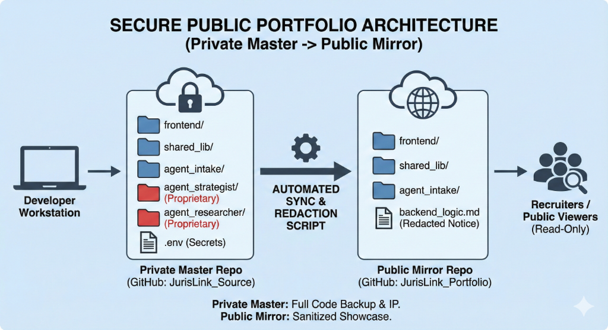

# JurisLink 🏛️⚖️

**AI-Powered Legal Assistant for Employment Law Cases**

JurisLink is a multi-agent legal AI system that helps clients navigate wrongful termination, workplace discrimination, harassment, and wage theft cases. It conducts thorough client interviews, performs real-time legal research, develops litigation strategies, and generates professional legal documents.


---

## 🚀 Try It Live!

> **[🔗 Launch JurisLink Demo](https://ambitious-sand-078aabe0f.4.azurestaticapps.net)**
> 
> *Experience the AI legal assistant in action. Describe a workplace issue and watch the multi-agent system analyze your case.*

---

## 🌟 Features

### Multi-Agent Architecture
- **Intake Agent** - Empathetic client interviewer that gathers comprehensive case details
- **Researcher Agent** - Performs real-time legal research using Tavily web search
- **Strategist Agent** - Develops litigation strategy based on facts and research
- **Writer Agent** - Generates professional PDF demand letters

### Modern UI
- ChatGPT-style dark theme interface
- Case history sidebar for managing multiple cases
- Collapsible details panel showing extracted facts, strategy, and documents
- Real-time document download

### Automated Testing
- Test agent with multiple legal scenarios
- Verification of facts extraction, research quality, and document generation

---

## 🏗️ Architecture



*Figure: Private Master vs. Public Portfolio Architecture*

---

## 🚀 Quick Start

### Prerequisites
- Python 3.12+
- Node.js 18+
- Azure Functions Core Tools v4
- OpenAI API Key
- Tavily API Key (free at [tavily.com](https://tavily.com))

### Installation

```bash
# Clone the repository
git clone https://github.com/yourusername/JurisLink.git
cd JurisLink

# Create and activate virtual environment
python -m venv .venv
.venv\Scripts\Activate.ps1  # Windows
# source .venv/bin/activate  # Linux/Mac

# Install Python dependencies
pip install -r requirements.txt

# Install frontend dependencies
cd frontend_portal
npm install
cd ..
```

### Configuration

Create `local.settings.json` in the root directory:

```json
{
  "IsEncrypted": false,
  "Values": {
    "AzureWebJobsStorage": "UseDevelopmentStorage=true",
    "FUNCTIONS_WORKER_RUNTIME": "python",
    "OPENAI_API_KEY": "sk-your-key-here",
    "TAVILY_API_KEY": "tvly-your-key-here"
  }
}
```

### Running the Application

**Terminal 1 - Backend:**
```bash
func start
```

**Terminal 2 - Frontend:**
```bash
cd frontend_portal
npm run dev
```

Open http://localhost:5173 in your browser.

---

## 🧪 Testing

Run the automated test suite:

```bash
python test_agent_scenarios.py
```

This will test 4 legal scenarios:
1. Wrongful Termination (Retaliation)
2. Age Discrimination
3. Hostile Work Environment
4. Wage Theft

---

## 📁 Project Structure

```
JurisLink_Solution/
├── function_app.py          # Azure Functions entry point & LangGraph
├── shared_lib/
│   └── state.py             # CaseState TypedDict definition
├── agent_intake/
│   ├── intake.py            # Intake node logic
│   └── instructions.md      # Agent persona & rules
├── agent_researcher/
│   ├── researcher.py        # Research node with Tavily
│   └── instructions.md      # Research output format
├── agent_strategist/
│   ├── strategist.py        # Strategy synthesis node
│   └── instructions.md      # Strategy template
├── agent_assistant/
│   ├── writer.py            # PDF generation node
│   └── instructions.md      # Letter format
├── frontend_portal/
│   ├── src/
│   │   ├── App.jsx          # Main React component
│   │   └── api.js           # Backend API client
│   └── package.json
├── test_agent_scenarios.py  # Automated test suite
└── requirements.txt
```

---

## 🛡️ Security

This project follows the **LAVA Protocol** (Layered Agent Verification Architecture):
- Sub-agents only import from `shared_lib`
- Inter-agent communication via structured JSON
- No direct file system access from agents
- API keys stored in environment variables (never committed)

---

## 🔮 Future Enhancements

- [ ] Multi-language support
- [ ] Integration with legal databases (Westlaw, LexisNexis)
- [ ] Case precedent matching with vector embeddings
- [ ] Client portal with case status tracking
- [ ] E-signature integration for documents
- [ ] Court filing automation

---

## 📄 License

MIT License - See [LICENSE](LICENSE) for details.

---

## 🤝 Contributing

Contributions are welcome! Please read our contributing guidelines before submitting a PR.

---

## 👨‍💻 Author

Built with ❤️ using modern AI/ML technologies.

**Tech Stack:** Python, LangChain/LangGraph, Azure Functions, React, Tailwind CSS, OpenAI GPT-4o, Tavily Search
