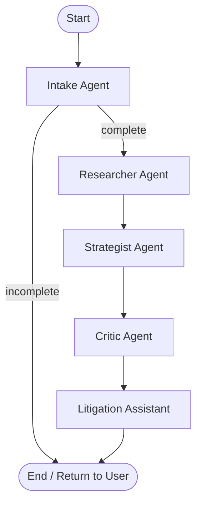

# JurisLink Backend Architecture

## Overview
The JurisLink backend is a serverless application built on **Azure Functions (Python v2)** using **LangGraph** for agent orchestration. It is designed to be stateless, relying on "State Echo" (passing the full state back and forth to the client) to manage conversation history and progress.

## Tech Stack
- **Runtime**: Python 3.10+
- **Host**: Azure Functions (HTTP Trigger)
- **Orchestration**: LangGraph
- **LLM Interface**: LangChain (OpenAI models)
- **State Serialization**: JSON

## Agent Flow (V2)
The system operates as a Directed Acyclic Graph (DAG) of specialized agents.



### Nodes
1.  **Intake Agent**: Interviews the user to gather the "5 Ws" (Who, What, Where, When, Why). Returns to user repeatedly until satisfied.
2.  **Researcher Agent**: Performs RAG (or simulated research) to find relevant Case Law and Statutes based on the facts.
3.  **Strategist Agent**: Synthesizes facts and law into a legal strategy (strength, weakness, recommended actions).
4.  **Critic Agent**: Reviews the strategy from an opposing counsel's perspective to find holes.
5.  **Litigation Assistant**: Generates formal legal documents (Demand Letter, Memo) based on the strategy.

## State Management
To remain serverless and cost-effective, we do not store session state in a database (Redis/SQL) for this version. Instead, we use **Hydration**:

1.  **Request**: Frontend sends `message` + `previous_state` (JSON).
2.  **Hydration**: Backend reconstructs the `CaseState` object from the JSON.
3.  **Execution**: LangGraph runs the next steps.
4.  **Response**: Backend returns the `response` + `final_state` (JSON).
5.  **Persistence**: Frontend stores `final_state` and sends it back in the next request.

## API Contract

### POST `/api/chat`

**Request Body:**
```json
{
  "message": "User input string",
  "history": [{"role": "user", "content": "..."}, ...], // Used for initial turn only
  "previous_state": { ... }, // Full serialized state from previous turn
  "language": "en" // Optional
}
```

**Response Body:**
```json
{
  "response": "Bot response text",
  "facts": { ... }, // Extracted case facts
  "research": "Markdown string...",
  "strategy": "Markdown string...",
  "critic": "Markdown string...",
  "docs": { "doc_name": "base64..." },
  "final_state": { ... }, // Opaque blob to return next time
  "status": "success",
  "iteration": 5
}
```
